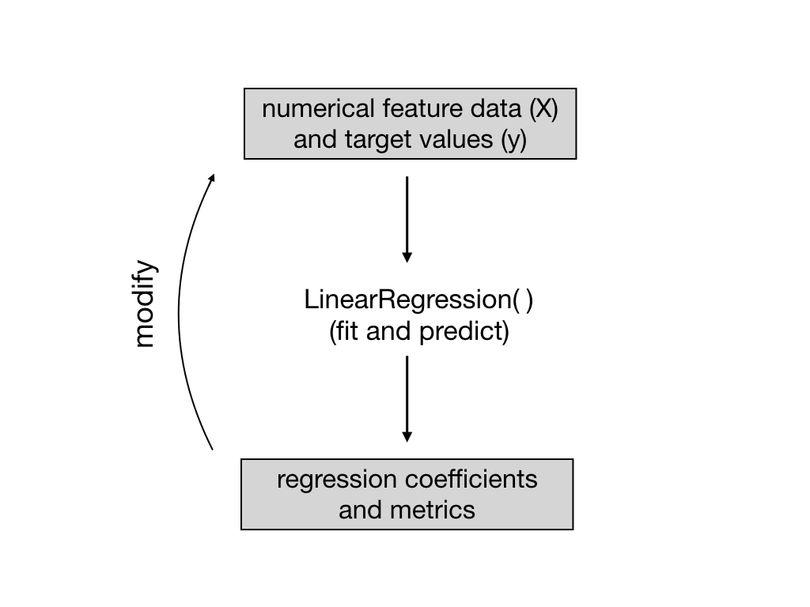

# "Data-driven A.I." applied to the Ames Housing regression problem

Throughout the regression analysis presented in this repository, we will be following Andrew Ng's "data-driven AI" paradigm.
That is, we will be sticking with  **ordinary least squares** (OLS) simple linear regression as our model throughout the bulk of the analysis and will be using iterations of its application to aid in the feature selection and construction process. A schematic of this idea is depicted in the
flow diagram below: the output of the simple linear regression is used to modify the original data set to improve downstream applications of the same simple linear regression.

In particular, features are selected using both regression coefficients from fit data and correlations with the target feature: house sale prices. The simplest scheme for feature construction involves generating multiplicative products of the original features. The final set of features is thus a target correlation filtered subset of the originals and the set of all products. By testing products of up to three features, it is found that third-order feature inclusion does not significantly improve the regression performance to justify the combinatorial headache they invite upon the programmer. 

Although elementary, the introduction of quadratic order product features nevertheless builds non-linearity into the modeling process even though a purely linear model is used for fitting and predicting. The performance metrics reveal that there is a substantial increase in predictive power due to the inclusion of these quadratic order features. 

Data-driven thinking enters the analysis also in the treatment of categorical features; in particular, the nominally nominal features. That is, the variable description file provided containing the meta-data labels certain features as nominal. However, upon basic exploration of the frequency counts of the values of these features and their relation to the target feature values, some of these features appear to have a natural ranking amongst their values. The numerical weights assigned to these more-ordinal-than-nominal features are naturally determined by the associated distribution of target feature values. This approach is related to target-encoding.
